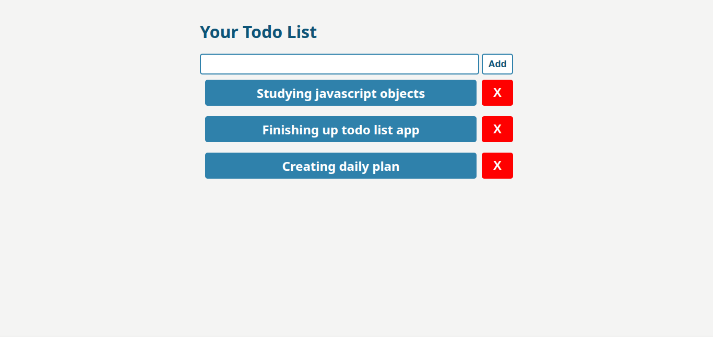

# Todo App
## Features
- Add a to do task
- Edit a to do task
- Remove a to do task
- Keep tasks in local storage
## Preview

## Usage
- Clone the repository
```
git clone https://github.com/firo1919/A2SV-Web-Learning-Path-G68.git
```
- Change directory
```
cd A2SV-Web-Learning-Path-G68/Task-1-TodoList/
```
- Open ```index.html``` in a browser
