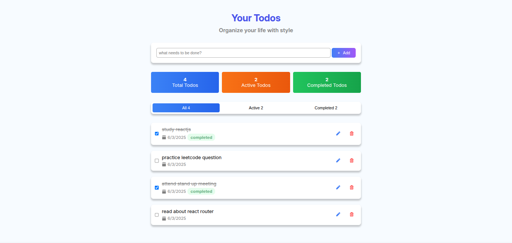
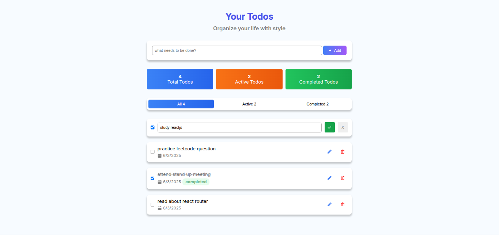
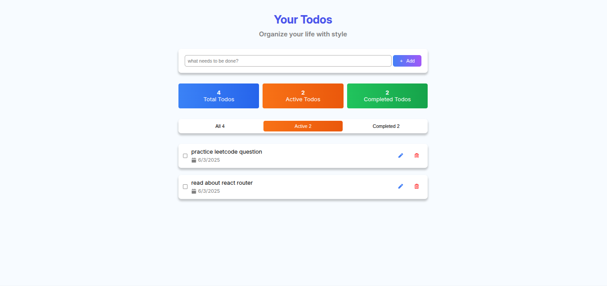

# Todo App
- A todo app built with Reactjs, typescript, css and html
## Features
- Add a to do task
- Edit a to do task
- Remove a to do task
- Keep tasks in local storage
- filter tasks by status
## Previews

### Editing tasks

### Filtering tasks


## Usage
- Clone the repository
```
git clone https://github.com/firo1919/A2SV-Web-Learning-Path-G68.git
```
- Change directory
```
cd A2SV-Web-Learning-Path-G68/Task-4-React-TodoApp/
```
- Run ```pnpm run dev``` in a terminal
- Visit ``` http://localhost:5173/``` inside a browser
