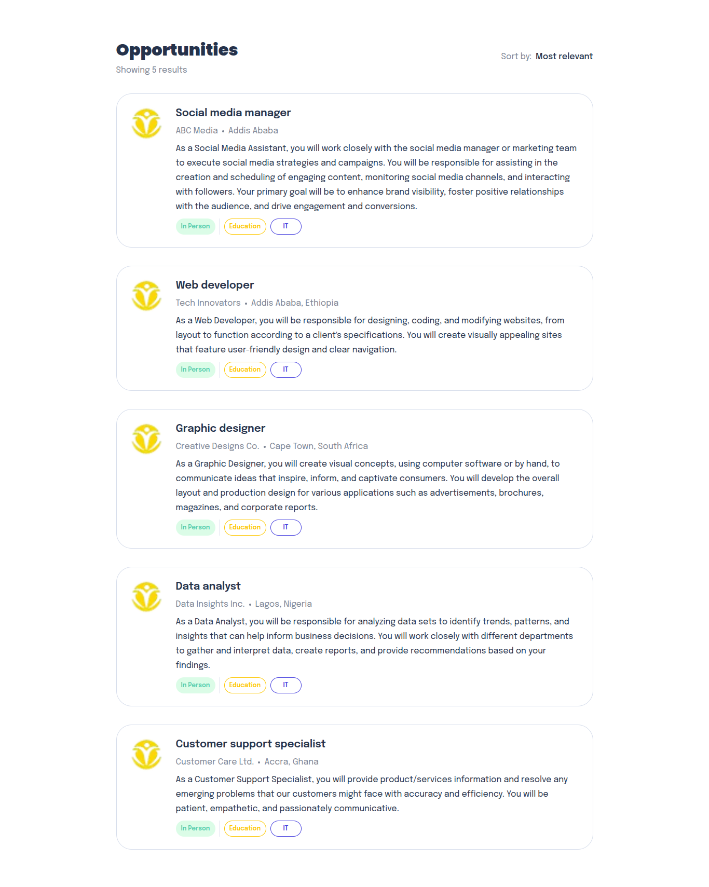
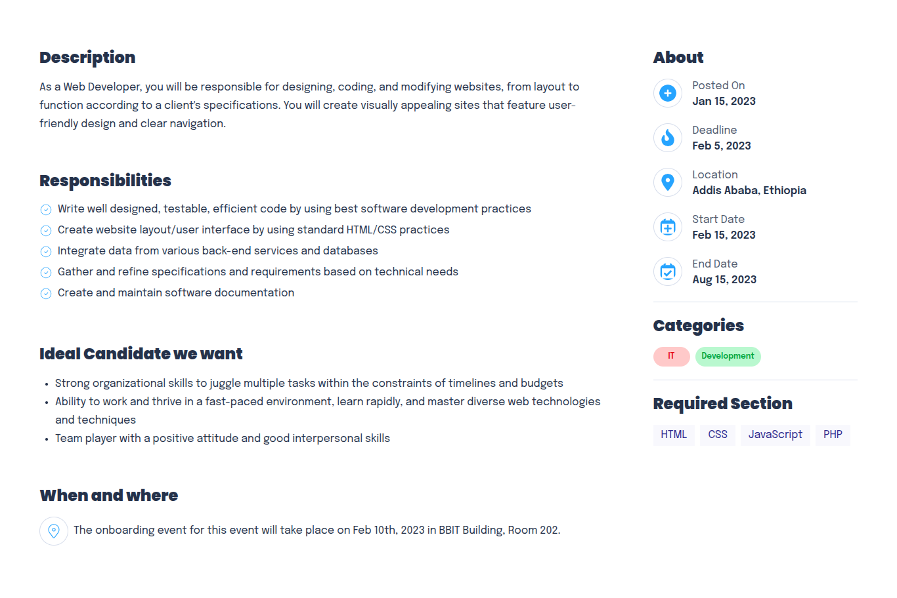

# Job Listing Web Application

A modern web application for browsing and exploring job opportunities, built with Next.js and TypeScript.

## Features

-   Browse a curated list of job postings
-   View detailed job descriptions and requirements
-   Filter jobs by categories and skills
-   Responsive design for desktop and mobile
-   Company information and onboarding event details

## Previews

-   ### /joblist

    

-   ### /joblist/1
    

## Usage

1. **Clone the repository:**

    ```bash
    git clone https://github.com/firo1919/A2SV-Web-Learning-Path-G68.git
    ```

    ```bash
    cd  A2SV-Web-Learning-Path-G68/Task-6-job-listing/
    ```

2. **Install dependencies:**

    ```bash
    npm install
    ```

3. **Run json server:**

    ```bash
    npx json-server src/data/jobs.json -p 3001
    ```

4. **Environment variables**
    - change `.example.env` to `.env`
5. **Run the development server:**

    ```bash
    npm run dev
    ```

6. **Open your browser:**
   Visit [http://localhost:3000/joblist](http://localhost:3000) to view the app.

## Project Structure

-   `src/app/` - Main application pages and layout
-   `src/components/` - Reusable UI components
-   `src/data/jobs.json` - Job postings data
-   `src/services/` - Service functions for data handling
-   `src/types/` - TypeScript type definitions

## Technologies Used

-   Next.js
-   React
-   TypeScript
-   CSS Modules
