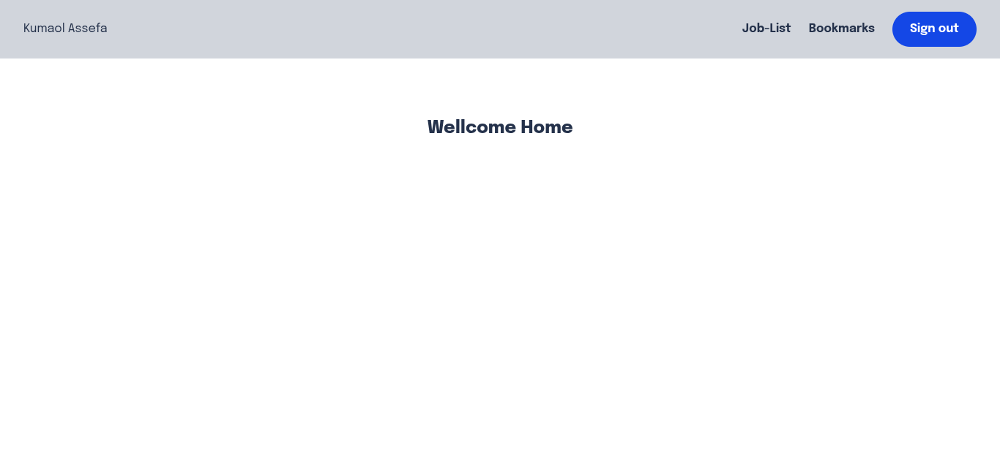

# Final Project: Job Listing & Bookmark Platform

A modern web application for discovering, bookmarking, and managing job opportunities. Built as a final project for A2SV, this platform provides a seamless experience for users to browse, search, and save jobs of interest.

---

## Features

-   User authentication with Google and email/password
-   Browse and search job opportunities
-   Bookmark jobs for quick access
-   Responsive design for all devices
-   Real-time feedback and notifications
-   Secure API integration
-   Profile management and verification
-   Error handling with user-friendly messages

---

## Technologies Used

-   **Next.js** (App Router)
-   **React** 19
-   **Redux Toolkit** (RTK Query)
-   **NextAuth.js** for authentication
-   **TypeScript**
-   **Tailwind CSS** for styling
-   **React Hook Form** & **Zod** for form validation
-   **React Toastify** for notifications
-   **Jest** & **React Testing Library** for testing
-   **Cypress** for end-to-end testing

---

## Previews

### Pages

#### Home Page (/)



#### Job List (/joblist)


#### Job Detail (/joblist/{id})


#### Bookmarks (/bookmarks)


#### Login (/login)


#### Register (/register)


#### Verify (/register/verify?email={email})


## Usage

1. **Clone the repository:**

    ```bash
    git clone https://github.com/firo1919/A2SV-Web-Learning-Path-G68.git
    cd final-task-bookmark-functionality
    ```

2. **Install dependencies:**

    ```bash
    npm install
    ```

3. **Set up environment variables in a `.env.local` file:**

    ```env
    AUTH_SECRET=<AUTH_SECRET>
    AUTH_GOOGLE_ID=<GOOGLE_ID>
    AUTH_GOOGLE_SECRET=<GOOGLE_SECRET>
    API_URL=<BACKEND_API_URL>
    ```

4. **Run the development server:**

    ```bash
    npm run dev
    ```

5. **Access the app:**
   Open [http://localhost:3000](http://localhost:3000) in your browser.

---

## Testing

-   **Unit Tests:**  
    Run all Jest tests:

    ```bash
    npm test
    ```

    We recommend installing an extension to run jest tests.

-   **End-to-End Tests:**  
    Open Cypress test runner:
    ```bash
    npm run cypress:open
    ```

---
