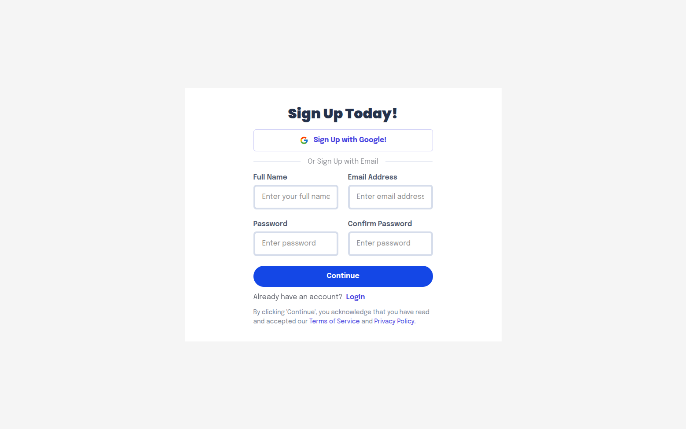
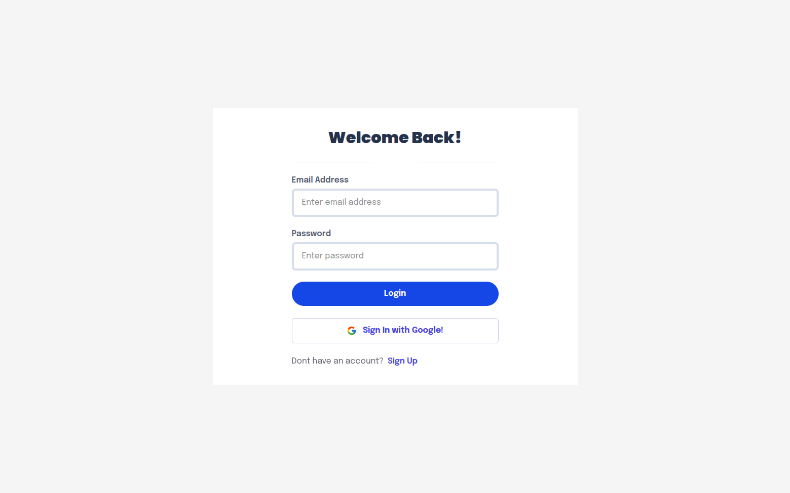
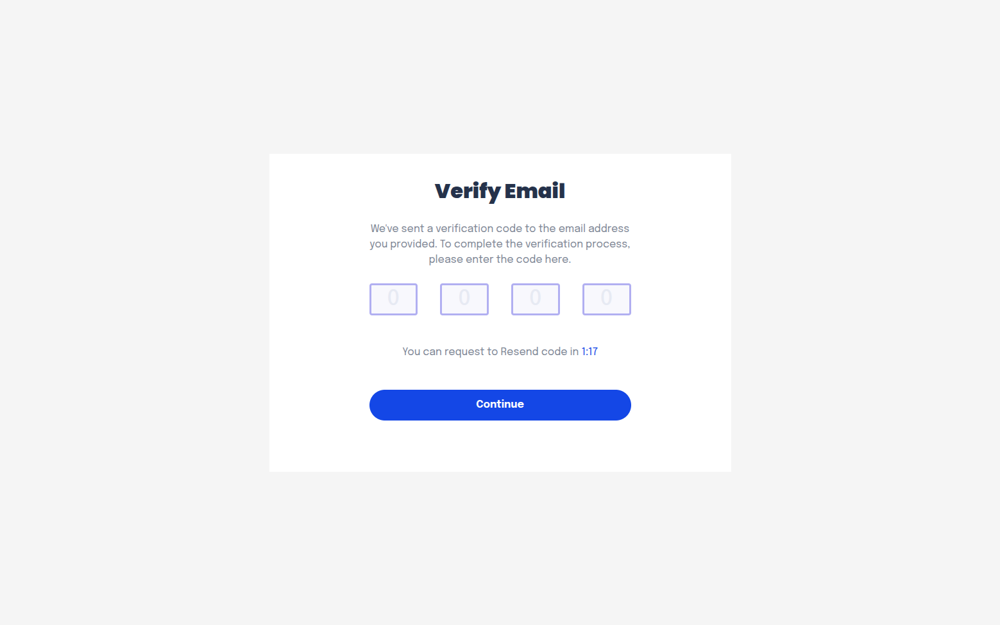
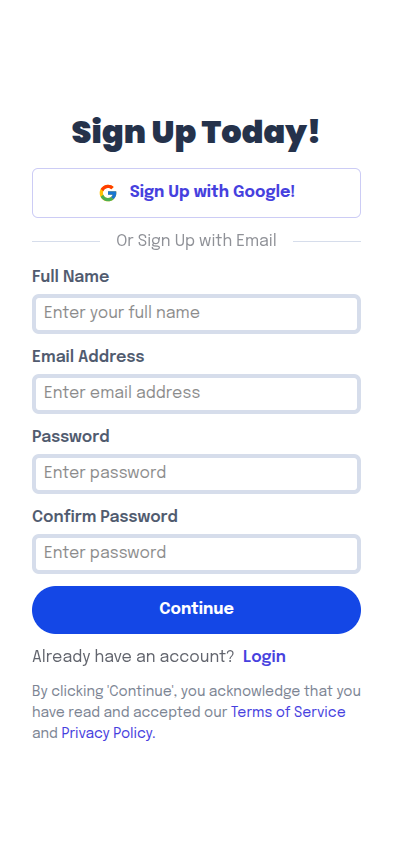
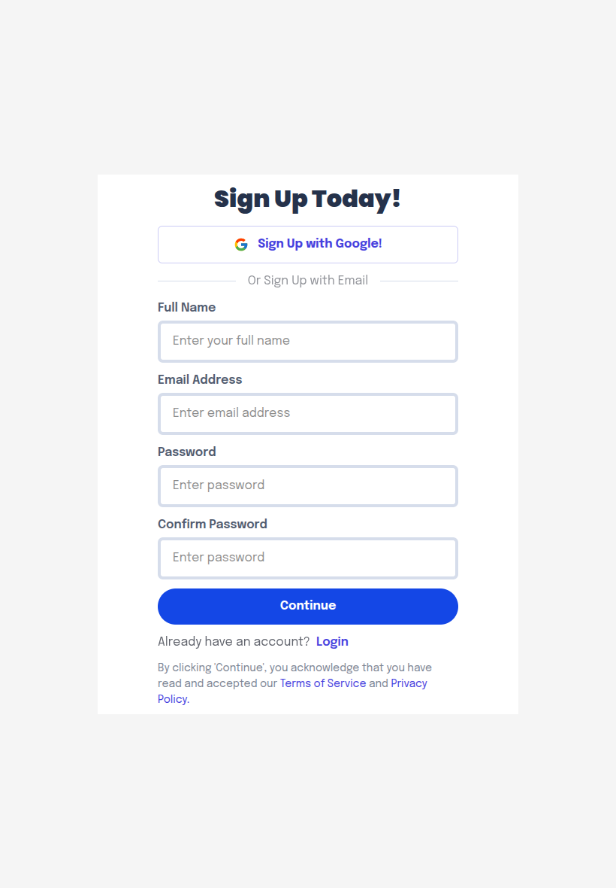

# Authentication with NextAuth

A simple authentication system built with Next.js and NextAuth, featuring email verification, Google OAuth, Credentials signins and secure protected routes.

## Features

-   User registration with email verification
-   Google OAuth authentication
-   Secure login and logout
-   Protected routes using Next.js middleware
-   Custom authentication pages (login, register, verify)

## Technologies used

-   Next.js (App Router)
-   TypeScript
-   next-auth
-   Tailwind CSS
-   React-hook-form
-   React-icons
-   React-otp-input
-   React-redux
-   React-timer-hook
-   React-toastify
-   zod
-   RTK Query

## Previews

### Pages

-   **/register**
    
-   **/login**
    
-   **/register/verify**
    

### Responsive

-   **Mobile**
    
-   **Tablet**
    
-   **Desktop**
    

## Usage

1. Clone the repository:

    ```bash
    git clone https://github.com/firo1919/A2SV-Web-Learning-Path-G68.git

    cd A2SV-Web-Learning-Path-G68/task-8-nextauth/

    ```

2. Install dependencies:
    ```bash
    npm install
    ```
3. Set up environment variables in a `.env.local` file:
    ```env
    AUTH_SECRET=<AUTH_SECRET>
    AUTH_GOOGLE_ID=<GOOGLE_ID>
    AUTH_GOOGLE_SECRET=<GOOGLE_SECRET>
    NEXT_PUBLIC_API_URL=<BACKEND_API_URL>
    ```
4. Run the development server:
    ```bash
    npm run dev
    ```
5. Access the app at `http://localhost:3000`
